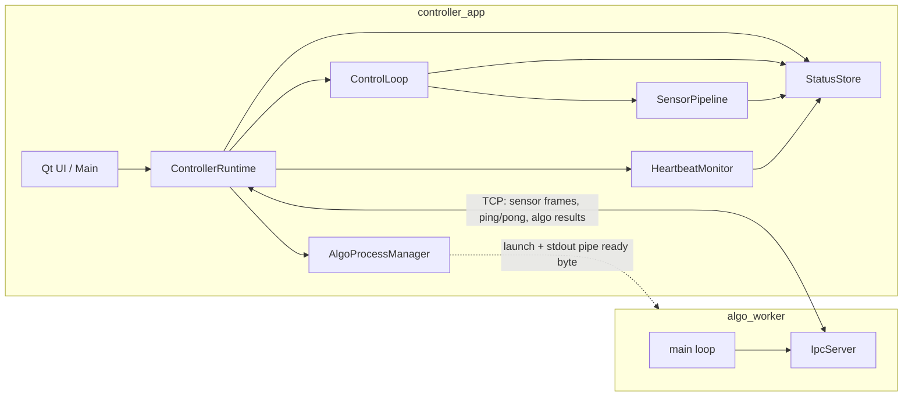
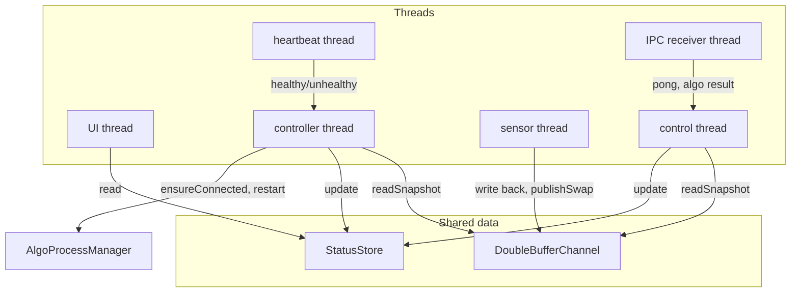
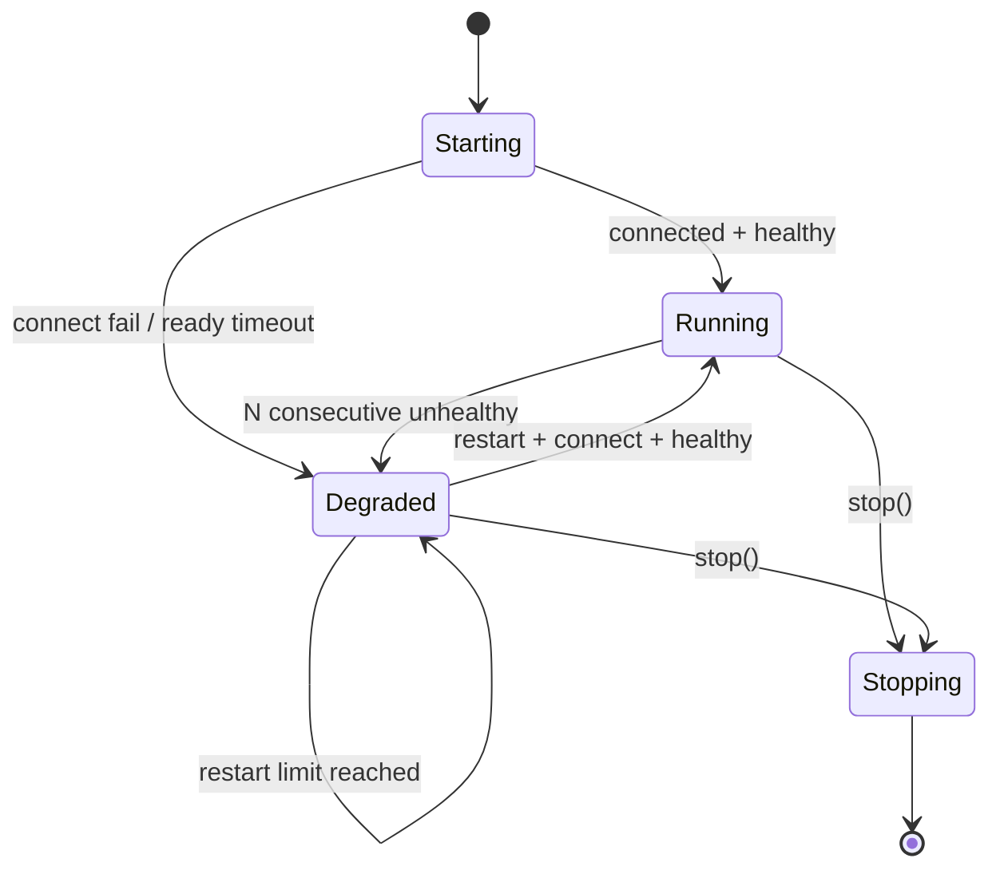
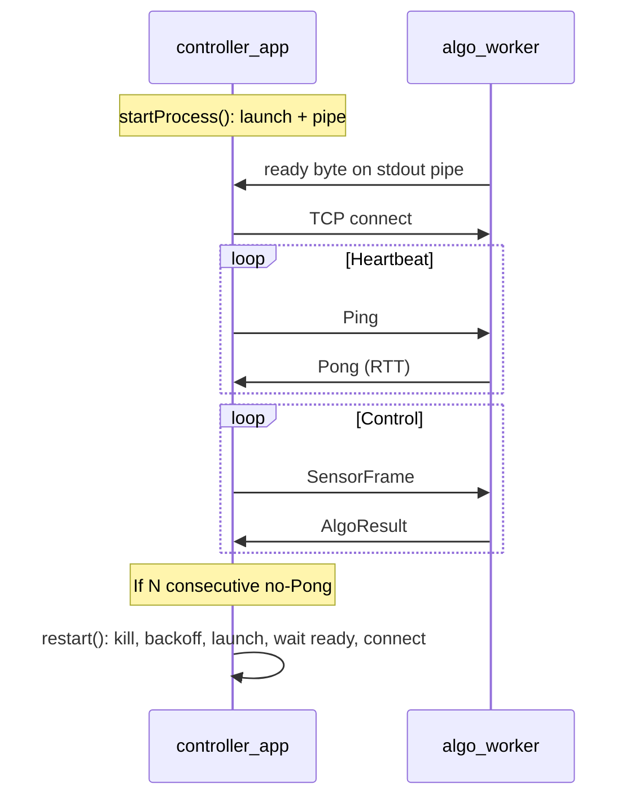
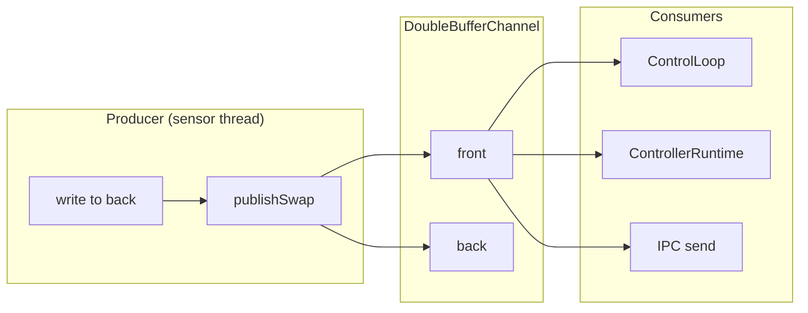

# Medical Robot Control Demo — Design Flow

## 1. Process & IPC overview

## 2. Controller process — threads & data flow

## 3. Startup & heartbeat / recovery flow

## 4. IPC message flow (controller ↔ algo_worker)

## 5. Double-buffer channel (sensor → consumers)

You can render these in VS Code (Mermaid extension), on GitHub, or at [mermaid.live](https://mermaid.live).
